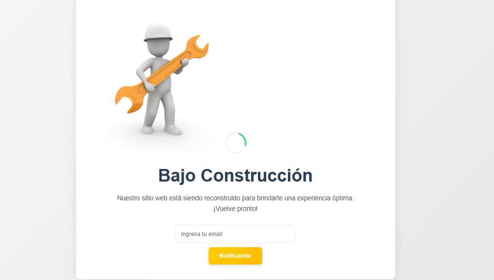

# Página "Bajo Construcción" 

## Descripción General
Proyecto de página web temporal para mostrar un mensaje de "Bajo Construcción" con un diseño moderno y funcionalidades básicas de interacción. Ideal para proyectos en desarrollo o mantenimiento.

## Características Principales
- **Diseño Responsive**: Se adapta automáticamente a todos los dispositivos (móviles, tablets, desktop)
- **Animaciones Suaves**: 
  - Efecto de zoom en la imagen principal
  - Cargador animado de espera
  - Transiciones en botones y campos de formulario
- **Interactividad**: 
  - Formulario de notificación por email (requiere backend)
  - Efectos hover en elementos clave
- **Optimización**: 
  - Carga rápida (< 200KB)
  - Compatibilidad con navegadores modernos
  - SEO básico implementado

